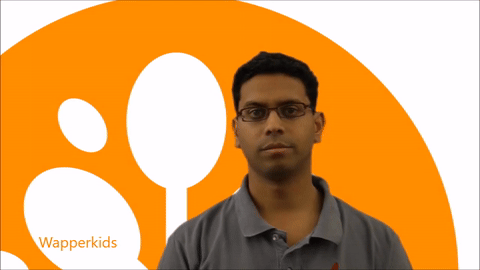
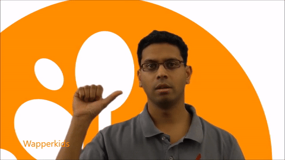
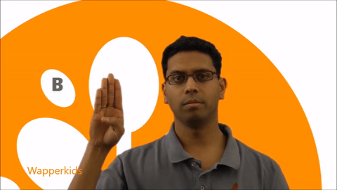
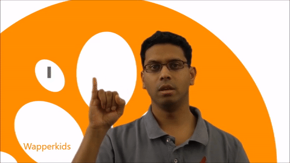
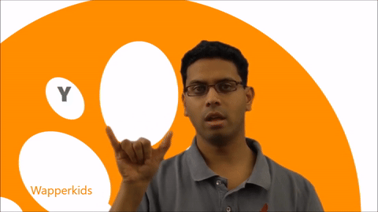

# NGT Sign Language Learning App

[](https://opensource.org/licenses/MIT)
[](https://www.python.org/downloads/)
[](https://pytorch.org/)
[](https://fastapi.tiangolo.com/)

A real-time sign language learning application that teaches the **NGT (Nederlandse Gebarentaal / Dutch Sign Language)** fingerspelling alphabet through webcam-based gesture recognition. Two deep learning models — a ResidualMLP for static letters and a Bidirectional LSTM for dynamic letters — provide instant feedback as the user practices.

<!-- TODO: Add a demo GIF or screenshot of the app in action here -->
<!--  -->

## How It Works

1. The webcam captures the user's hand via the browser (WebRTC)
2. Frames are streamed to the FastAPI backend over WebSocket
3. MediaPipe extracts 21 hand landmarks (63 features: x, y, z per landmark)
4. Landmarks are normalized and routed to the appropriate model:
   - **Static letters (A-I, K-Y)**: single-frame classification by the ResidualMLP
   - **Dynamic letters (J, Z)**: 30-frame sequence classification by the Bidirectional LSTM
5. The prediction is validated against the target letter and feedback is returned in real time

## Models

### Static sign classifier — ResidualMLP

- 4 residual blocks with skip connections, BatchNorm, and GELU activations
- Input: 63 features (21 landmarks x 3 coordinates)
- Output: 25 classes (24 letters + nonsense class)
- Validation accuracy: ~95%

### Dynamic sign classifier — Bidirectional LSTM

- 2-layer bidirectional LSTM
- Input: sequences of 30 frames x 63 features
- Output: 2 classes (J, Z)
- Validation accuracy: ~92%

<!-- TODO: Embed confusion matrices here once regenerated -->
<!--  -->
<!--  -->

## Features

- **Real-time hand detection** via MediaPipe
- **Dual-model architecture** routing static and dynamic letters to the appropriate classifier
- **Recording-based workflow** with a 3-second capture window per attempt
- **Two practice modes**: sequential (A-Z) and random order
- **Bilingual interface**: English and Dutch
- **Hint system** that activates after repeated failed attempts
- **Tutorial GIFs** demonstrating each letter's hand shape
- **Progress tracking** with accuracy and attempt counts

<p align="center">
  
  
  
  
  
</p>

## Tech Stack

**Backend**: FastAPI, WebSocket, PyTorch, MediaPipe, OpenCV, scikit-learn

**Frontend**: Vanilla JavaScript, WebRTC, WebSocket API, CSS3

**Training**: PyTorch, MediaPipe, pandas, matplotlib, tqdm

## Project Structure

```
sign-language/
├── src/
│   ├── backend/
│   │   ├── api/              # FastAPI routes and Pydantic schemas
│   │   ├── core/             # Session management, letter sequencing, config
│   │   ├── detection/        # Hand capture, static/dynamic detectors
│   │   ├── models/           # Model architectures (ResidualMLP, LSTM)
│   └── assets/               # Tutorial GIFs (A-Z)
├── training/
│   ├── static/               # CNN training pipeline (data gathering, augmentation, training)
│   └── dynamic/              # LSTM training pipeline
├── models/                   # Trained weights (not tracked by git, see models/README.md)
│   ├── static/               # ResidualMLP weights
│   ├── dynamic/              # LSTM weights
│   └── hand_landmarker.task  # MediaPipe model
├── data_collect/             # Landmark recording utilities
├── dataset_builder/          # Dataset creation and augmentation tools
├── scripts/                  # Setup scripts (Linux/macOS, Windows)
├── frontend/                 # Web interface (HTML, JS, CSS)
├── main.py                   # Application entry point
└── pyproject.toml            # Project metadata and dependencies
```

## Installation

### Prerequisites

- Python 3.12+
- Webcam
- GPU (optional, for faster inference)

### Quick setup

The setup scripts create a virtual environment, install dependencies, and download model weights from the GitHub release automatically.

**Linux / macOS:**
```bash
git clone https://github.com/filipp-lotsmanov/sign-language.git
cd sign-language
chmod +x scripts/setup.sh
./scripts/setup.sh
```

**Windows (PowerShell):**
```powershell
git clone https://github.com/filipp-lotsmanov/sign-language.git
cd sign-language
.\scripts\setup.ps1
```

### Manual setup

```bash
uv venv
source .venv/bin/activate    # Linux/macOS
# .venv\Scripts\activate     # Windows

uv pip install -e .
```

Then download model weights from the [latest release](https://github.com/filipp-lotsmanov/sign-language/releases) and place them in `models/` (see [`models/README.md`](models/README.md)).

### Running the app

```bash
python main.py
```

Then open `http://localhost:8000` in your browser.

## Usage

1. Click **Start Camera** and allow browser webcam access
2. Choose a practice mode: **ABC** (sequential) or **Random**
3. Position your hand clearly in the frame
4. Click **Record** and hold the sign for 3 seconds
5. Receive instant feedback — correct signs advance to the next letter
6. Use **Skip** to move on, or wait for hints after 3 failed attempts

## Configuration

Key parameters can be adjusted in `src/backend/core/config.py`:

| Parameter | Default | Description |
|-----------|---------|-------------|
| `RECORDING_DURATION` | 3.0s | Capture window per attempt |
| `CONFIDENCE_THRESHOLD` | 0.6 | Minimum confidence for a valid prediction |
| `HINT_THRESHOLD_ATTEMPTS` | 3 | Failed attempts before showing a hint |
| `DYNAMIC_BUFFER_SIZE` | 30 | Frames required for LSTM inference |

## Training

To retrain the models from scratch, see the scripts in `training/`:

```bash
# Static model (ResidualMLP)
cd training/static
python train.py

# Dynamic model (LSTM)
cd training/dynamic
python train.py
```

Training data is not included in the repository. See `data_collect/` for landmark recording tools and `dataset_builder/` for dataset creation utilities.

## Limitations
 
- **Dataset quality.** No pre-existing NGT fingerspelling dataset was available at the time of development. The training data was manually recorded by team members who are not native sign language users, which means some hand shapes may not perfectly reflect how fluent NGT signers form certain letters. As a result, the model may confuse visually similar letters.

- **Mixed data sources.** To compensate for limited NGT-specific data, the training pipeline combines landmarks extracted from ASL and DGS (German Sign Language) image datasets where the hand shapes overlap with NGT. Letters where the NGT form differs significantly (e.g. T, which in ASL carries an offensive meaning in Dutch culture) were recorded separately. This mixing may introduce subtle inconsistencies.

- **Lighting and hand positioning.** Recognition accuracy depends on consistent lighting and a clearly visible hand centered in the frame. Poor lighting, partial occlusion, or unusual hand angles degrade performance.

- **Single hand only.** The system detects and processes one hand at a time. If both hands are visible, only the first detected hand is used.

- **Letter-level recognition only.** The app includes a sentence mode where users can enter a word or phrase and spell it out letter by letter, but recognition still operates on individual letters — there is no word-level sign recognition or language model interpreting letter sequences.


## License

This project is licensed under the MIT License. See [LICENSE](LICENSE) for details.